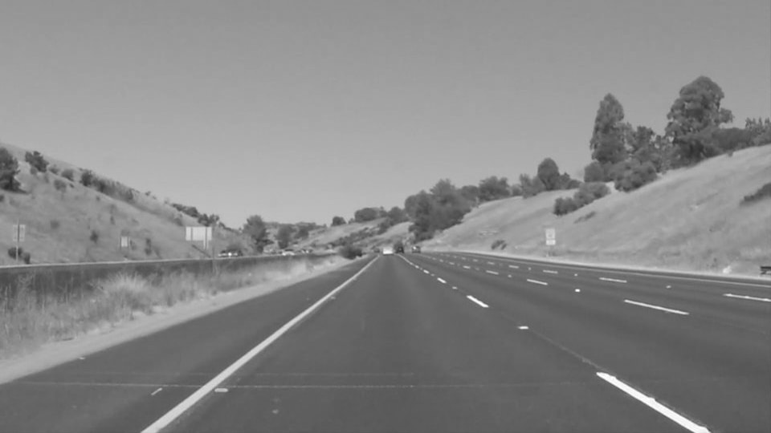
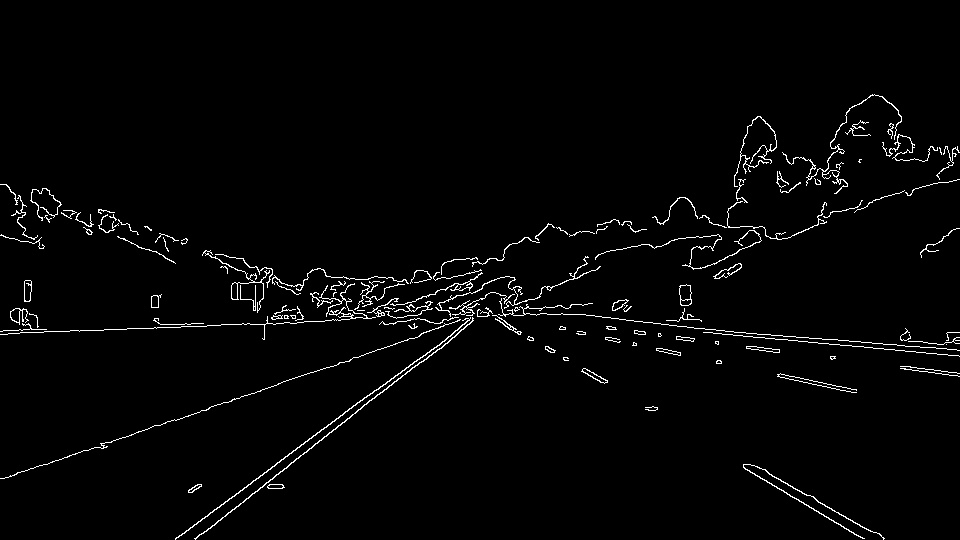
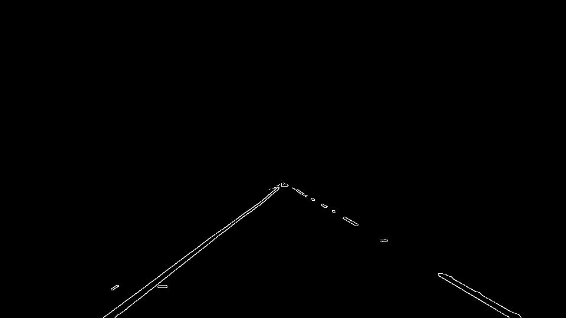
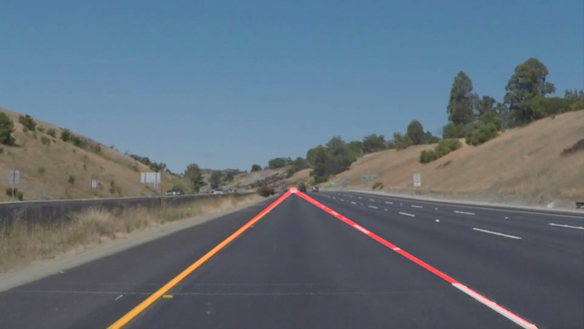

# **初级车道线检测** 

### 流程

车道先检测流程分为如下7个步骤

#### Step 1 . 读取图片

使用matplotlib.image库读取图片，并显示

#### Step 2. 将彩色图像转化为灰度图

使用grayscale()函数将rgb图像转化为灰度图

#### Step 3. 平滑图片

使用gaussian_blur()函数平滑图片以去除图像噪声

#### Step 4. 对图像进行边缘提取

使用canny()函数对图像进行边缘提取

#### Step 5. 设置图像的感兴趣区域

通过region_of_interest()函数设置一个三角区域作为感兴趣区域

#### Step 6. 霍夫变换和线性拟合

使用霍夫变换找到图像中的直线，随后根据直线的斜率判断是左车道线还是右车道线。最后使用polyfit()函数获取左右车道的车道线方程。

#### Step 7. 将车道线结果投影到图像中

使用weighted_img()方法将原始图像与车道线混合

项目详细的中文描述及解析见《[初识图像之初级车道线检测](https://zhuanlan.zhihu.com/p/52623916)》
