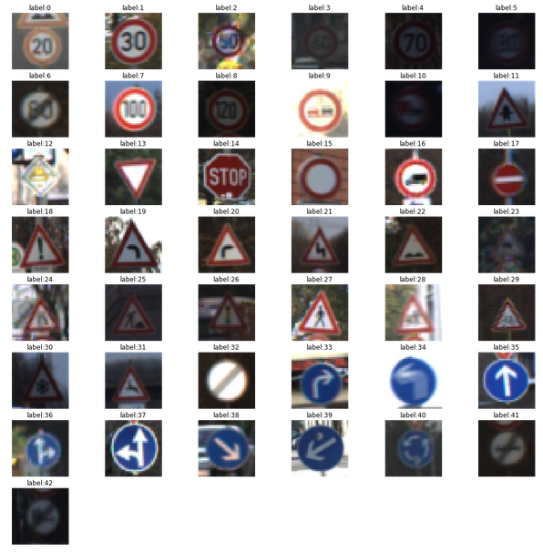
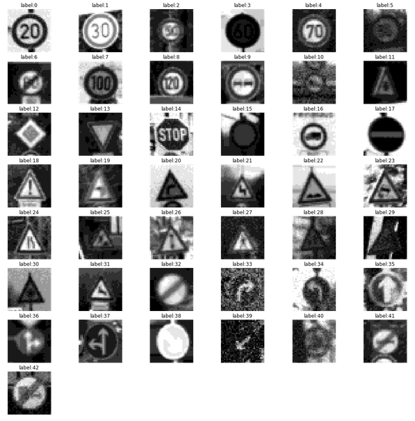
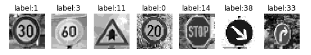

# **交通标志牌识别** 

---

**创建一个交通标志牌识别项目**

项目目的及步骤如下：
* 导入数据集
* 可视化数据集
* 设计，训练，测试网络模型
* 在新图像上使用模型，进行类型预测
* 在新图像上分析softmax概率
* 整理文档

---
### 导入数据集

使用pickle库导入43种不同类型的交通标志牌

数据集包含34799张训练集，4410张验证集和12630张测试集

图像的数据尺寸为(32, 32, 3)

### 可视化和统计图像数据集的特征

使用matplotlib可视化43种不同的交通标志牌



使用**imgaug库**使用高斯噪声及改变亮度等方法实现**数据增广**


### 设计，训练和测试网络模型

#### 预处理

首先将训练集，验证集和测试集的图像从rgb转换至灰度图；然后对他们做归一化；最后显示预处理的图像。



#### 网络模型

我使用的模型的架构如下：
| Layer         		|     Layer Info	        						|
|:---------------------:|:-------------------------------------------------:|
| Input         		| (32x32x1) Grayscale&Normalized image |
| Convolution 5x5     	| (1x1) stride, 'VALID' padding, outputs (28x28x6) |
| RELU					|													|
| Max pooling	      	| (2x2) stride,  outputs (14x14x6) 		|
| Convolution 5x5	    | (1x1) stride, 'VALID' padding, outputs (10x10x16) |
| RELU					|													|
| Max pooling	      	| (2x2) stride,  outputs (5x5x16) 		|
| Flatten	        	| outputs 400 										|
| Fully connected		| outputs 120  										|
| RELU					|													|
| Dropout				| keep probability = 0.5 							|
| Fully connected		| outputs 84  										|
| RELU					|													|
| Dropout				| keep probability = 0.5 						|
| Fully connected		| outputs 43 logits  								|

#### 超参数

1. Number of epochs = 20


2. Batch size = 128

3. Learning rate = 0.001

4. Optimizer - Adam algorithm

5. Dropout = 0.5 for training set , Dropout= 1.0 for valid and test set

#### 调试过程记录

使用原始的LeNet-5网络，在验证集上的准确度为0.89

At first, Using the original LeNet-5 architecture, I got a accuracy of 0.89 in validation set. 

对图像进行预处理后，发现训练集精度高但验证集精度低，这意味着网络过拟合

使用数据增广的方式，还是存在过拟合的问题

于是在网络中加入dropout层，最终得到了一个比较好的结果

模型结果的精确度如下所示

- 训练集精度 0.99368

- 验证集精度 0.95238

- 测试集精度 0.93571

### 在新图像上测试

显示在Web上找到的标志牌图像


图1,图4和图7的背景较复杂可能分类错误；图2和图5包含噪声和有旋转，可能分类错误

图像预处理后如下所示



使用模型预测标志牌类型结果：

```
image:0 : Prediction Succeed
Label : 1 Prediction:1

image:1 : Prediction Succeed
Label : 3 Prediction:3

image:2 : Prediction Succeed
Label : 11 Prediction:11

image:3 : Prediction Succeed
Label : 0 Prediction:0

image:4 : Prediction Succeed
Label : 14 Prediction:14

image:5 : Prediction Succeed
Label : 38 Prediction:38

image:6 : Prediction Succeed
Label : 33 Prediction:33
```


项目详细的中文描述及解析见《[初识深度学习之交通标志分类](https://zhuanlan.zhihu.com/p/57160727)》