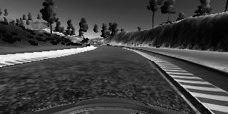
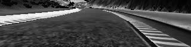

# 无人车行为克隆 

#### 行为克隆项目

项目的主要流程如下：
* 使用模拟器采集正常驾驶的行为火速据
* 利用Keras建立卷积神经网络模型用于预测方向盘转角
* 在数据集中训练和验证模型
* 测试模型
* 总结
* 

#### 文件介绍

**drive.py** 用于加载模型，使无人车自动驾驶，默认车速 : 18km/h

**model.h5** 提交的模型

**model.py** 训练模型的代码

**video.mp4** track 1的驾驶结果时评


#### 如何运行代码

训练模型运行：

```
python model.py
```

加载并使无人车在模拟器中运动

```
python drive.py model.h5
```


#### 模型架构

使用Keras搭载的模型如下所示：

```
input_shape = (160, 320, 3)
ouput_shape = (160, 320, 1)
normal_shape = (80, 320, 1)
model = Sequential()
model.add(Lambda(color2gray, input_shape = input_shape, output_shape= ouput_shape))
model.add(Cropping2D(cropping=((50,30), (0,0))))
model.add(Lambda(lambda x: x/127.5 - 1., output_shape= normal_shape))
model.add(Convolution2D(24,5,5,subsample=(2,2), activation="relu"))
model.add(Convolution2D(36,5,5,subsample=(2,2), activation="relu"))
model.add(Convolution2D(48,5,5,subsample=(2,2), activation="relu"))
model.add(Convolution2D(64,3,3, activation="relu"))
model.add(Convolution2D(64,3,3, activation="relu"))
model.add(Flatten())
model.add(Dropout(0.5)) # reduce overfitting
model.add(Dense(180, activation="relu"))
model.add(Dense(60))
model.add(Dense(10, activation="relu"))
model.add(Dense(1))
```

模型参考了Nvidia无人车团队发表的端到端CNN网络，我在flatten层后加入了一层dropout用于减少过拟合，然后用relu函数增加非线性。

|       Layer       |                 Description                  |
| :---------------: | :------------------------------------------: |
|       Input       |        color image, size [160x320x3]         |
|      Lambda       | convert color to grayscale, size [160x320x1] |
|    Cropping2D     |     cropping the image, size [80x320x1]      |
|      Lambda       |      normalization, outputs [80x320x1]       |
| Convolution2D 5x5 |          2x2 stride, valid padding           |
|       RELU        |            introduce nonlinearity            |
| Convolution2D 5x5 |          2x2 stride, valid padding           |
|       RELU        |            introduce nonlinearity            |
| Convolution2D 5x5 |          2x2 stride, valid padding           |
|       RELU        |            introduce nonlinearity            |
| Convolution2D 3x3 |          1x1 stride, valid padding           |
|       RELU        |            introduce nonlinearity            |
| Convolution2D 3x3 |          1x1 stride, valid padding           |
|       RELU        |            introduce nonlinearity            |
|      Flatten      |                                              |
|      Dropout      |            keep probability = 0.5            |
|  Fully connected  |                  output 180                  |
|       RELU        |            introduce nonlinearity            |
|  Fully connected  |                  output 60                   |
|  Fully connected  |                  output 10                   |
|       RELU        |            introduce nonlinearity            |
|  Fully connected  |                   output 1                   |

图像输入如下：


在该项目中，颜色对决策的影响不大，因此将其转换为灰度图像：



图像的顶部和底部对决策的影响不大，因此将图像进行裁剪：




#### 如果减少网络的过拟合

1. 采集了顺时针和逆时针的驾驶数据，防止方向转角总朝一个方向
2. 使用dropout层减少过拟合
3. 使用左右摄像头增广数据


项目详细的中文描述及解析见《[深度学习进阶之无人车行为克隆](https://zhuanlan.zhihu.com/p/60625133)》