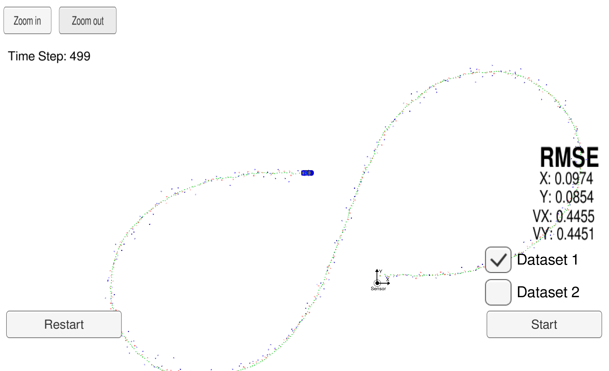

## 扩展卡尔曼滤波器项目

### 编译和运行

```
$ mkdir build
$ cd build
$ cmake .. & make
$ ./ExtendedKF
```

### 可视化

下载EKF模拟器： [EKF_Simulator](https://github.com/udacity/self-driving-car-sim/releases/) ，解压后运行如下指令

```
$ cd term2_sim_linux
$ chmod a+x term2_sim.x86_64
$ ./term2_sim.x86_64
```

按下start键即可看到可视化结果

### Result



数据集1的RMSE结果为 [0.0974, 0.0854, 0.4455, 0.4451]


数据集1的RMSE结果为[0.0726, 0.0964, 0.4093, 0.4769].


项目详细的中文描述及解析见《[手把手教你写扩展卡尔曼滤波器](https://zhuanlan.zhihu.com/p/63641680)》和《[手把手教你实现多传感器融合技术](https://zhuanlan.zhihu.com/p/67139241)》