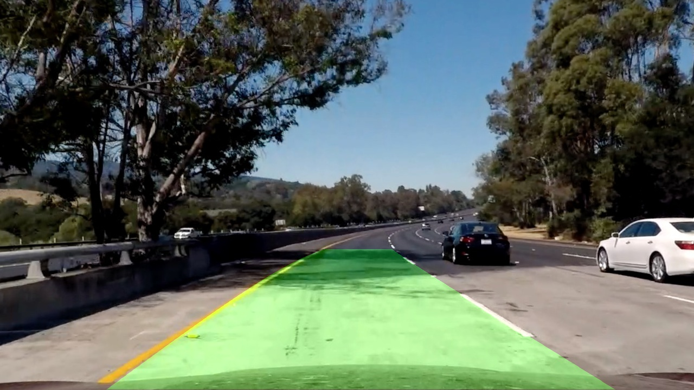
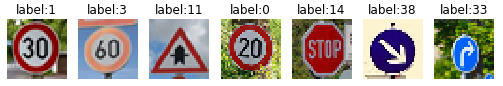
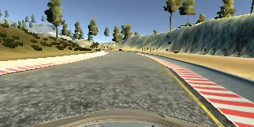

# Udacity-Self-Driving-Car-Engineer
This repository includes some projects which have been finished in **Udacity-Self-Driving-Car-Engineer-Nanodegree**. 

These projects includes:

1. **CarND-LaneLines-P1**

   

2. **CarND-Advanced-Lane-Lines**

3. **CarND-Traffic-Sign-Classifier-Project**

4. **CarND-Behavioral-Cloning**

