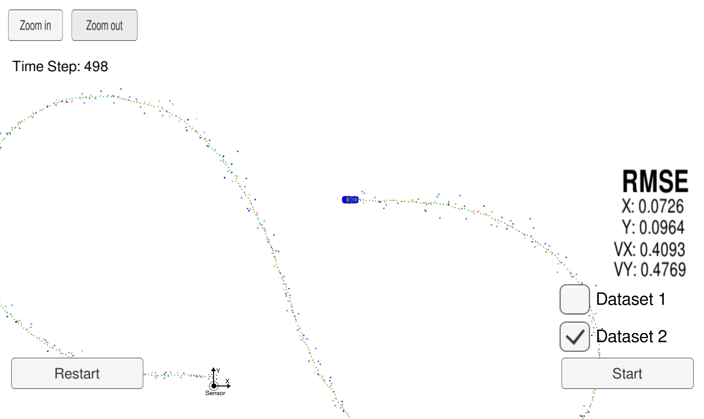

# 优达学城无人驾驶工程师纳米学位

*Udacity-Self-Driving-Car-Engineer*包含了在优达学城无人驾驶工程师纳米学位学习过程中所完成的项目，这些项目包含：

1. **初级车道线检测项目**

   

2. **高级车道线检测项目**

3. **交通标志牌识别项目**

4. **无人车行为克隆项目**

5. **多传感器融合项目**

6. **无迹卡尔曼滤波器**
7. **无人车定位项目**

